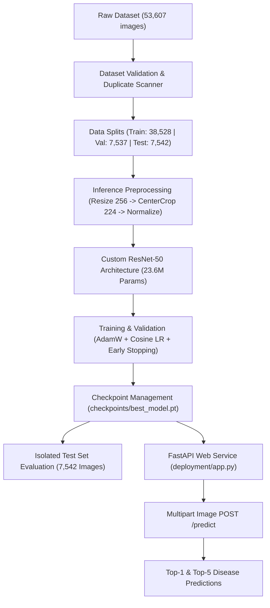

# ResNet-50 Crop Disease Classification System

An end-to-end computer vision pipeline for agricultural plant disease detection built with PyTorch and served via FastAPI. The system classifies crop leaf images into 38 distinct health and disease categories using a custom ResNet-50 deep convolutional neural network. 

Early detection of agricultural plant diseases is critical for preventing crop loss and ensuring food security. This repository provides a complete machine learning lifecycle solution—from dataset validation, data leakage prevention, and model training with Automatic Mixed Precision (AMP), to model evaluation and production-ready REST API deployment.

---

## Key Results

The model was evaluated on an isolated test set of 7,542 images across 38 crop disease classes. The test set was kept strictly untouched during model training, hyperparameter tuning, and checkpoint selection.

| Metric | Score / Value |
| :--- | :--- |
| **Top-1 Accuracy** | **98.49%** |
| **Top-5 Accuracy** | **99.97%** |
| **Macro Precision** | 0.9847 |
| **Macro Recall** | 0.9828 |
| **Macro F1 Score** | 0.9835 |
| **Weighted F1 Score** | 0.9848 |
| **Macro AUROC** | 1.0000 |
| **Macro AUPRC** | 0.9986 |
| **Expected Calibration Error (ECE)** | 0.0048 |
| **Average Batch Latency (FP16, BS=32)** | 50.14 ms |
| **Inference Throughput** | 638.26 images/sec |
| **Peak GPU VRAM Usage** | 432.9 MB |

*Evaluation performed using an NVIDIA GeForce RTX 3050 6GB Laptop GPU under CUDA 12.1.*

---

## System Architecture



---

## Model Architecture

The core classifier uses a standard **ResNet-50** deep residual network architecture implemented from scratch in [`src/model.py`](file:///d:/resnet%20crop%20detection/src/model.py):

- **Backbone**: 4 residual stages (`Conv2_x` through `Conv5_x`) using 16 Bottleneck residual blocks with 1x1, 3x3, and 1x1 convolutions.
- **Parameters**: 23,585,894 total parameters (~23.6M), 100% trainable.
- **Output Layer**: Fully connected classifier mapping 2,048 feature channels to 38 output class logits.
- **Model Size**: ~90 MB on disk.
- **Checkpoint Location**: Saved atomically to [`checkpoints/best_model.pt`](file:///d:/resnet%20crop%20detection/checkpoints/best_model.pt).
- **Execution Modes**: Native PyTorch `CUDA` execution with automatic fallback to `CPU`.

---

## Dataset

The project operates on a 38-class crop leaf dataset containing a total of **53,607 validated images**:

- **Training Split**: 38,528 images
- **Validation Split**: 7,537 images
- **Test Split**: 7,542 images
- **Class Mapping**: Stored as a master JSON dictionary in [`results/class_to_idx.json`](file:///d:/resnet%20crop%20detection/results/class_to_idx.json).

### Class Coverage
The dataset covers 38 categories across various crops (Apple, Blueberry, Cherry, Corn, Grape, Orange, Peach, Pepper Bell, Potato, Raspberry, Soybean, Squash, Strawberry, Tomato), differentiating healthy leaves from bacterial, fungal, and viral infections (e.g., *Tomato Target Spot*, *Apple Black Rot*, *Corn Common Rust*).

---

## Preprocessing & Data Transforms

To guarantee zero distribution shift between evaluation and deployment, image preprocessing follows an identical pipeline:

1. **Color Conversion**: Ensure 3-channel RGB image format.
2. **Resize**: Rescale image short side to 256 pixels (`transforms.Resize(256)`).
3. **Center Crop**: Crop central 224 × 224 region (`transforms.CenterCrop(224)`).
4. **Tensor Conversion**: Scale pixel values to `[0.0, 1.0]` (`transforms.ToTensor()`).
5. **Normalization**: Apply standard ImageNet channel statistics:
   - Mean: `[0.485, 0.456, 0.406]`
   - Std: `[0.229, 0.224, 0.225]`

---

## Training Pipeline

The training pipeline in [`src/train.py`](file:///d:/resnet%20crop%20detection/src/train.py) implements modern training practices:

- **Loss Function**: `nn.CrossEntropyLoss`
- **Optimizer**: `AdamW` (Learning Rate: `3e-4`, Weight Decay: `1e-4`)
- **Scheduler**: `CosineAnnealingLR` (Min LR: `1e-6`)
- **Mixed Precision**: Automatic Mixed Precision (`torch.cuda.amp.GradScaler`) for accelerated GPU computation.
- **Early Stopping**: Monitored on validation loss with patience of 10 epochs.
- **Reproducibility**: Global seed initialization (`seed=42`, cuDNN deterministic mode).
- **Sanity Checks**: Synthetic batch forward/backward step verification prior to training execution.

---

## Evaluation Artifacts

Evaluation is executed by [`src/evaluate.py`](file:///d:/resnet%20crop%20detection/src/evaluate.py) using `torch.inference_mode()` on the isolated test set. Outputs are automatically logged to [`results/`](file:///d:/resnet%20crop%20detection/results/):

- [`results/test_evaluation_report.json`](file:///d:/resnet%20crop%20detection/results/test_evaluation_report.json): Full quantitative metric report.
- [`results/confusion_matrix.png`](file:///d:/resnet%20crop%20detection/results/confusion_matrix.png): 38x38 normalized confusion matrix heatmap.
- [`results/roc_curves.png`](file:///d:/resnet%20crop%20detection/results/roc_curves.png): Multi-class Receiver Operating Characteristic curves.
- [`results/precision_recall_curves.png`](file:///d:/resnet%20crop%20detection/results/precision_recall_curves.png): Precision-Recall curves.
- [`results/calibration_plot.png`](file:///d:/resnet%20crop%20detection/results/calibration_plot.png): Reliability diagram for Expected Calibration Error analysis.

---

## FastAPI Deployment

A production-ready REST API service is provided under [`deployment/`](file:///d:/resnet%20crop%20detection/deployment/).

### Key Deployment Features
- **Single Model Load**: Loads [`checkpoints/best_model.pt`](file:///d:/resnet%20crop%20detection/checkpoints/best_model.pt) into GPU/CPU memory once on application startup using FastAPI lifespan context manager.
- **Authoritative Class Index**: Uses [`results/class_to_idx.json`](file:///d:/resnet%20crop%20detection/results/class_to_idx.json) for output decoding.
- **Optimized Inference**: Executes model forward pass inside `torch.inference_mode()`.
- **Top-5 Predictions**: Returns top-1 predicted disease class along with top-5 sorted probability scores.
- **Clean Error Handling**: Catches corrupted images, empty buffers, and unsupported file types, returning structured HTTP status codes (`400`, `415`, `500`) without exposing Python tracebacks.

### Install Dependencies
```bash
python -m pip install -r deployment/requirements.txt
```

### Run the FastAPI Server
```bash
uvicorn deployment.app:app --host 0.0.0.0 --port 8000
```

### API Endpoints

| Method | Endpoint | Description |
| :--- | :--- | :--- |
| `GET` | `/` | API status, model name, and class count |
| `GET` | `/health` | Application health and active device (`cuda`/`cpu`) |
| `POST` | `/predict` | Accept multipart image upload and return disease classification |
| `GET` | `/docs` | Interactive Swagger UI documentation |
| `GET` | `/redoc` | ReDoc API documentation |

### Example Inference Request
```bash
curl -X POST "http://localhost:8000/predict" \
     -H "accept: application/json" \
     -H "Content-Type: multipart/form-data" \
     -F "file=@data/test/tomato___target_spot/sample_leaf.jpg"
```

### Example JSON Response
```json
{
  "predicted_class": "tomato___target_spot",
  "confidence": 0.9691,
  "confidence_percentage": 96.91,
  "top_5_predictions": [
    {
      "class": "tomato___target_spot",
      "confidence": 0.9691
    },
    {
      "class": "tomato___bacterial_spot",
      "confidence": 0.0306
    },
    {
      "class": "tomato___spider_mites_two_spotted_spider_mite",
      "confidence": 0.0002
    },
    {
      "class": "tomato___early_blight",
      "confidence": 0.0
    },
    {
      "class": "tomato___septoria_leaf_spot",
      "confidence": 0.0
    }
  ]
}
```

---

## Project Structure

```text
resnet crop detection/
├── checkpoints/              # Trained model checkpoints (best_model.pt, last_model.pt)
├── configs/                  # Global YAML configuration (config.yaml)
├── data/                     # Dataset split directories (train/, val/, test/)
├── deployment/               # FastAPI deployment service
│   ├── app.py                # FastAPI routes, CORS, lifespan startup & error handlers
│   ├── model.py              # ModelEngine singleton inference class
│   ├── preprocessing.py      # Image validation and transform pipeline
│   ├── schemas.py            # Pydantic request/response schemas
│   └── requirements.txt      # Deployment-only Python dependencies
├── logs/                     # Training metrics CSV and text logs
├── results/                  # Evaluation JSON reports, CSVs, and visualization plots
├── src/                      # Core machine learning package
│   ├── benchmark.py          # Latency, throughput, and VRAM benchmarking
│   ├── dataset.py            # PyTorch Datasets and DataLoaders
│   ├── dataset_validation.py # Dataset integrity, alignment, and leakage scanner
│   ├── evaluate.py           # Comprehensive model evaluation runner
│   ├── metrics.py            # Top-K, macro/weighted metrics, and calibration functions
│   ├── model.py              # ResNet-50 architecture definition
│   ├── train.py              # Training loop, AMP, and early stopping
│   └── utils.py              # Reproducibility seed, device resolution, and logging
├── tests/                    # Unit test suite for validation, model, and pipeline
└── requirements.txt          # Full training & development dependencies
```

---

## Running Verification & Development Tools

### Run Full Unit Test Suite
```bash
python -m unittest discover tests
```

### Run Dataset Validation & Leakage Check
```bash
python -m src.dataset_validation
```

### Dry-Run Training Pipeline Verification
```bash
python -m src.train --config configs/config.yaml --verify
```

### Run Full Test Set Model Evaluation
```bash
python -m src.evaluate --config configs/config.yaml --checkpoint checkpoints/best_model.pt
```
