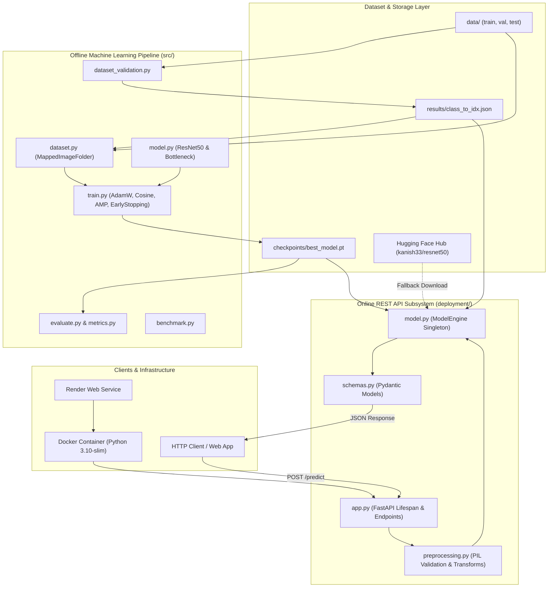
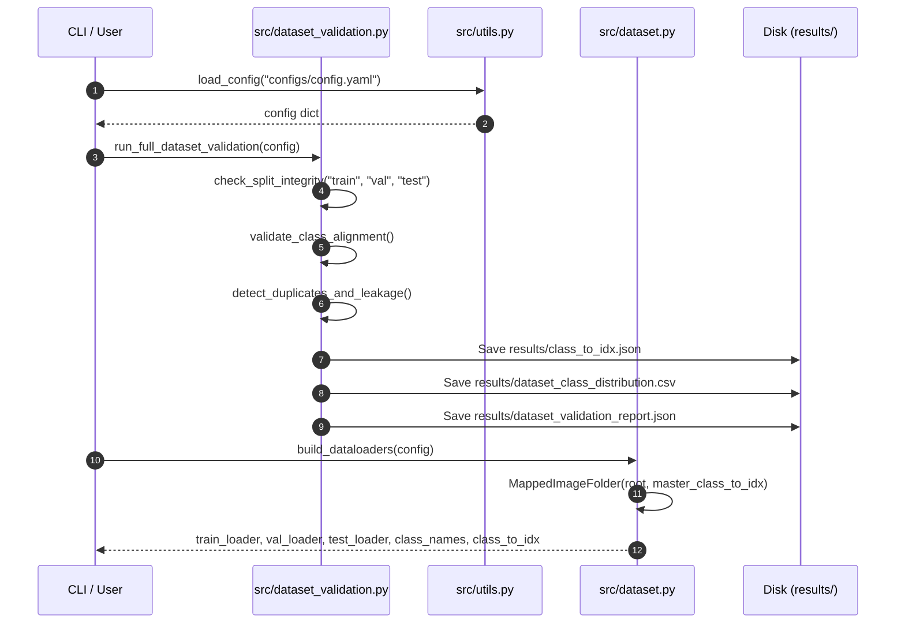
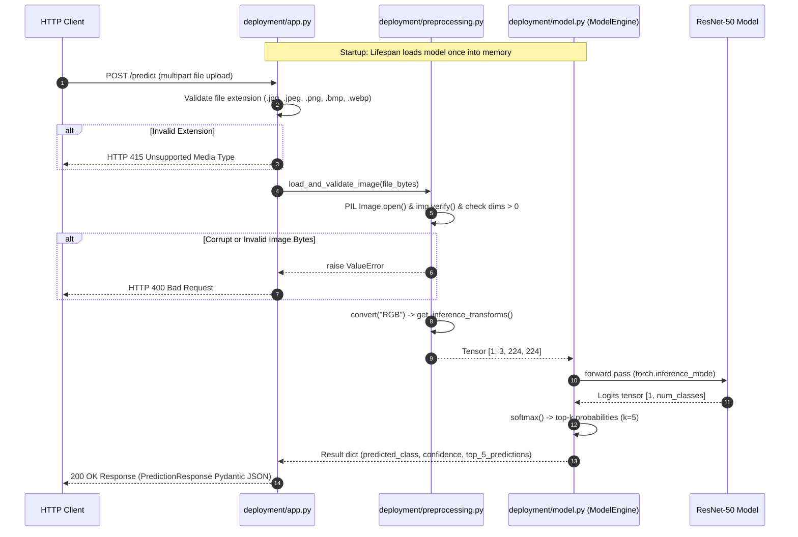

# System Architecture — ResNet-50 Crop Disease Detection

This document specifies the end-to-end system architecture, module relationships, execution flows, and component interactions of the ResNet-50 Crop Disease Detection repository.

---

## 🏛️ High-Level System Architecture

The repository is structured into two main operational subsystems:
1. **Offline ML Pipeline (`src/`)**: Data validation, dataset preparation, custom ResNet-50 model training, evaluation, and benchmarking.
2. **Online Serving Subsystem (`deployment/`)**: Production FastAPI REST API, singleton model engine, image verification, and response serialization.



---

## 🧩 Module Relationship Matrix

| Module / Component | Import Dependencies | Dependent Modules | Core Responsibility | Source File Reference |
| :--- | :--- | :--- | :--- | :--- |
| **`src/utils.py`** | `yaml`, `torch`, `numpy`, `random`, `logging`, `csv` | `dataset.py`, `dataset_validation.py`, `model.py`, `train.py`, `evaluate.py`, `deployment/model.py` | Config loading, random seed reproducibility, GPU/CPU device detection, checkpoint loading/saving, logging. | [`src/utils.py`](file:///d:/resnet%20crop%20detection/src/utils.py:L13-L181) |
| **`src/dataset_validation.py`** | `PIL.Image`, `hashlib`, `statistics`, `src.utils` | `tests/test_milestone2.py` | Data integrity scan, file corruption check, intra-split duplicate detection, cross-split leakage scan, class alignment. | [`src/dataset_validation.py`](file:///d:/resnet%20crop%20detection/src/dataset_validation.py:L15-L517) |
| **`src/dataset.py`** | `torchvision`, `torch.utils.data`, `PIL`, `src.utils` | `train.py`, `evaluate.py`, `model.py`, `tests/test_milestone2.py` | `MappedImageFolder` subclass, dynamic class inference, ImageNet transforms, DataLoader factory, sample visualization. | [`src/dataset.py`](file:///d:/resnet%20crop%20detection/src/dataset.py:L19-L306) |
| **`src/model.py`** | `torch`, `torch.nn`, `src.utils` | `train.py`, `evaluate.py`, `deployment/model.py`, `tests/test_milestone3.py` | Custom `ResNet50` & `Bottleneck` PyTorch blocks, `build_model`, weight initialization, parameter count sanity check. | [`src/model.py`](file:///d:/resnet%20crop%20detection/src/model.py:L13-L375) |
| **`src/train.py`** | `torch.optim`, `torch.amp`, `src.utils`, `src.model`, `src.dataset` | `tests/test_milestone4.py` | Full training loop, AdamW optimizer, Cosine Annealing, AMP GradScaler, EarlyStopping, atomic checkpointing. | [`src/train.py`](file:///d:/resnet%20crop%20detection/src/train.py:L28-L667) |
| **`src/metrics.py`** | `scikit-learn`, `matplotlib`, `PIL`, `numpy` | `evaluate.py`, `tests/test_milestone5.py` | Metric computation (Top-1/5, Macro/Weighted F1, AUROC, AUPRC, 15-bin ECE), plot generation (CM, Reliability, ROC, PR). | [`src/metrics.py`](file:///d:/resnet%20crop%20detection/src/metrics.py:L30-L373) |
| **`src/evaluate.py`** | `src.utils`, `src.model`, `src.dataset`, `src.metrics`, `src.benchmark` | `tests/test_milestone5.py` | Standalone test set evaluation orchestrator, master report generator (`test_evaluation_report.json`). | [`src/evaluate.py`](file:///d:/resnet%20crop%20detection/src/evaluate.py:L34-L276) |
| **`src/benchmark.py`** | `torch`, `numpy`, `time` | `evaluate.py` | Warm-up & timed inference latency/throughput benchmarking routine. | [`src/benchmark.py`](file:///d:/resnet%20crop%20detection/src/benchmark.py:L9-L100) |
| **`deployment/app.py`** | `fastapi`, `deployment.schemas`, `deployment.model` | Docker container, Render | FastAPI application instance, lifespan model loading hook, GET `/`, GET `/health`, POST `/predict` routes. | [`deployment/app.py`](file:///d:/resnet%20crop%20detection/deployment/app.py:L12-L146) |
| **`deployment/model.py`** | `torch`, `src.model`, `src.utils`, `deployment.preprocessing` | `deployment/app.py` | `ModelEngine` singleton class, Hugging Face checkpoint auto-downloader, batch inference executor. | [`deployment/model.py`](file:///d:/resnet%20crop%20detection/deployment/model.py:L12-L150) |
| **`deployment/preprocessing.py`** | `PIL.Image`, `torchvision.transforms`, `io.BytesIO` | `deployment/model.py` | Byte stream verification, PIL RGB conversion, image dimension validation, center crop inference transforms. | [`deployment/preprocessing.py`](file:///d:/resnet%20crop%20detection/deployment/preprocessing.py:L12-L65) |
| **`deployment/schemas.py`** | `pydantic` | `deployment/app.py` | Data validation schemas for API metadata, health status, prediction output, and error responses. | [`deployment/schemas.py`](file:///d:/resnet%20crop%20detection/deployment/schemas.py:L5-L41) |

---

## 🔄 Execution Flows

### 1. Data Processing & Validation Sequence Flow



---

### 2. Model Training & Atomic Checkpointing Sequence Flow

```mermaid
sequenceDiagram
    autonumber
    participant TrainCLI as python -m src.train
    participant Trainer as src/train.py
    participant Model as src/model.py (ResNet50)
    participant Opt as AdamW & CosineScheduler
    participant Scaler as AMP GradScaler
    participant Disk as Checkpoint Directory

    TrainCLI->>Trainer: run_real_training(config)
    Trainer->>Model: build_model(config)
    Trainer->>Opt: build_optimizer() & build_scheduler()
    Trainer->>Scaler: GradScaler(enabled=cuda)
    
    loop Epoch 1 to 50
        Trainer->>Model: train_one_epoch()
        Note over Model: Forward pass in torch.amp.autocast()
        Scaler->>Model: scale(loss).backward()
        Scaler->>Opt: step(optimizer) & update()
        Trainer->>Model: validate_one_epoch() (no_grad)
        Trainer->>Trainer: EarlyStopping.step(val_loss)
        Trainer->>Disk: save_atomic_checkpoint(last_model.pt)
        opt New Best Val Loss
            Trainer->>Disk: save_atomic_checkpoint(best_model.pt)
        end
    end
```

---

### 3. REST API Image Prediction Sequence Flow



---

## 🔒 Component Boundaries & Operational Policies

1. **Test Dataset Protection Policy**: The test dataset (`data/test`) is strictly isolated and **never** used during training, validation, early stopping, or checkpoint selection ([`src/train.py`](file:///d:/resnet%20crop%20detection/src/train.py:L500-L502), [`src/evaluate.py`](file:///d:/resnet%20crop%20detection/src/evaluate.py:L236-L239)).
2. **Master Class Mapping Authority**: Class mapping relies on [`results/class_to_idx.json`](file:///d:/resnet%20crop%20detection/results/class_to_idx.json) created during dataset validation. Both training and deployment load this file as the authoritative class index mapping ([`src/dataset.py`](file:///d:/resnet%20crop%20detection/src/dataset.py:L61-L75), [`deployment/model.py`](file:///d:/resnet%20crop%20detection/deployment/model.py:L63-L67)).
3. **Model Weight Loading Authority**: At deployment startup, `ModelEngine` loads local weights from `checkpoints/best_model.pt`. If missing, it downloads the weights from Hugging Face Hub ([`deployment/model.py`](file:///d:/resnet%20crop%20detection/deployment/model.py:L29-L54)).
