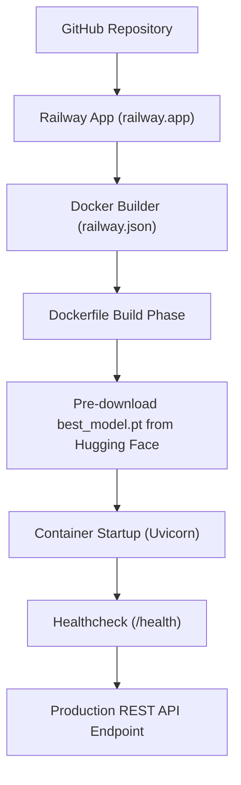

# Serving Stack & Deployment Guide — ResNet-50 Crop Disease Detection

This document provides complete build, containerization, serving stack, dependency, and cloud deployment process documentation (Railway & Render) derived directly from [`Dockerfile`](file:///d:/resnet%20crop%20detection/Dockerfile), [`railway.json`](file:///d:/resnet%20crop%20detection/railway.json), [`render.yaml`](file:///d:/resnet%20crop%20detection/render.yaml), [`deployment/requirements.txt`](file:///d:/resnet%20crop%20detection/deployment/requirements.txt), and [`deployment/app.py`](file:///d:/resnet%20crop%20detection/deployment/app.py).

---

## 🚂 Railway Cloud Deployment Guide

The repository includes native zero-config deployment support for **Railway** (`https://railway.app`) via [`railway.json`](file:///d:/resnet%20crop%20detection/railway.json) and [`Dockerfile`](file:///d:/resnet%20crop%20detection/Dockerfile).



### Railway Configuration (`railway.json`)

```json
{
  "$schema": "https://railway.app/railway.schema.json",
  "build": {
    "builder": "DOCKERFILE",
    "dockerfilePath": "Dockerfile"
  },
  "deploy": {
    "healthcheckPath": "/health",
    "healthcheckTimeout": 300,
    "restartPolicyType": "ON_FAILURE",
    "restartPolicyMaxRetries": 10
  }
}
```

### Model Pre-Downloading & Auto-Fetch on Railway

1. **Build Phase Pre-Download**: During `docker build`, the Dockerfile automatically downloads the pre-trained model weights directly into `/app/checkpoints/best_model.pt` from Hugging Face:
   ```bash
   https://huggingface.co/kanish33/resnet50/resolve/main/best_model.pt
   ```
2. **Runtime Fallback Auto-Fetch**: If the checkpoint is missing on container startup, `ModelEngine` in [`deployment/model.py:L29-L54`](file:///d:/resnet%20crop%20detection/deployment/model.py#L29-L54) automatically fetches `best_model.pt` from `HF_MODEL_URL` before serving traffic.

---

### Step-by-Step Railway Deployment Options

#### Option A: Deploy via Railway Web Dashboard (Recommended)
1. Push your codebase to a **GitHub / GitLab** repository.
2. Log in to [Railway Dashboard](https://railway.app/dashboard).
3. Click **+ New Project** -> Select **Deploy from GitHub repo**.
4. Select your `ResNet50-Plant-Disease-Detection` repository.
5. Railway automatically detects [`railway.json`](file:///d:/resnet%20crop%20detection/railway.json) and [`Dockerfile`](file:///d:/resnet%20crop%20detection/Dockerfile).
6. Under **Variables** (Optional):
   - `PORT`: Automatically managed by Railway (e.g. `8080`).
   - `HF_MODEL_URL`: `https://huggingface.co/kanish33/resnet50/resolve/main/best_model.pt` (default built into Dockerfile).
   - `CORS_ORIGINS`: `*` (Allows cross-origin requests from any frontend).
7. Railway will build the container, execute the pre-download from Hugging Face, run the healthcheck at `/health`, and assign a public `.up.railway.app` URL.

#### Option B: Deploy via Railway CLI
```powershell
# 1. Install Railway CLI (if not already installed)
npm i -g @railway/cli

# 2. Login to Railway account
railway login

# 3. Initialize & Link Project
railway init

# 4. Deploy directly from current directory
railway up
```

---

## 🐳 Docker Containerization Architecture

The application is containerized using a slim Debian Bookworm Python 3.10 base image ([`Dockerfile:L2`](file:///d:/resnet%20crop%20detection/Dockerfile#L2)).

| Dockerfile Stage / Instruction | Command executed | Rationale & Codebase Impact | Line Reference |
| :--- | :--- | :--- | :--- |
| **Base Image** | `FROM python:3.10-slim-bookworm` | Minimizes image size while ensuring compatibility with PyTorch binary wheels. | [`Dockerfile:L2`](file:///d:/resnet%20crop%20detection/Dockerfile#L2) |
| **Environment** | `ENV PYTHONUNBUFFERED=1 PYTHONPATH=/app PORT=8080 ...` | Configures unbuffered output logging, PYTHONPATH resolution, and default HTTP port. | [`Dockerfile:L5-L9`](file:///d:/resnet%20crop%20detection/Dockerfile#L5-L9) |
| **System Packages** | `apt-get install -y --no-install-recommends curl libgomp1` | Installs `curl` (for healthcheck) and `libgomp1` (OpenMP library for CPU PyTorch inference). | [`Dockerfile:L14-L17`](file:///d:/resnet%20crop%20detection/Dockerfile#L14-L17) |
| **PyTorch CPU Wheels** | `pip install torch torchvision --extra-index-url https://download.pytorch.org/whl/cpu` | Installs CPU-only PyTorch binaries to reduce container footprint by several gigabytes. | [`Dockerfile:L23-L26`](file:///d:/resnet%20crop%20detection/Dockerfile#L23-L26) |
| **Python Dependencies** | `pip install -r /app/deployment/requirements.txt` | Installs FastAPI, Uvicorn, Pillow, PyYAML, Pydantic serving dependencies. | [`Dockerfile:L29-L30`](file:///d:/resnet%20crop%20detection/Dockerfile#L29-L30) |
| **Code & Artifacts Copy** | `COPY src/ configs/ results/ deployment/` | Copies required application modules and class index JSON artifacts. | [`Dockerfile:L33-L36`](file:///d:/resnet%20crop%20detection/Dockerfile#L33-L36) |
| **Pre-Download Model** | `python -c "import urllib.request; urllib.request.urlretrieve('https://huggingface.co/kanish33/...', '/app/checkpoints/best_model.pt')"` | Downloads PyTorch model weights during container build phase so container starts instantly without download latency. | [`Dockerfile:L39-L40`](file:///d:/resnet%20crop%20detection/Dockerfile#L39-L40) |
| **Health Check** | `HEALTHCHECK --interval=30s --timeout=5s --start-period=30s --retries=3 CMD curl -f http://localhost:8080/health \|\| exit 1` | Automatically monitors API server health using the GET `/health` endpoint. | [`Dockerfile:L46-L47`](file:///d:/resnet%20crop%20detection/Dockerfile#L46-L47) |
| **Entrypoint Command** | `CMD ["sh", "-c", "uvicorn deployment.app:app --host 0.0.0.0 --port ${PORT:-8080}"]` | Starts high-performance ASGI Uvicorn server bound to `$PORT`. | [`Dockerfile:L50`](file:///d:/resnet%20crop%20detection/Dockerfile#L50) |

---

## ☁️ Render Infrastructure-as-Code Blueprint (`render.yaml`)

Cloud deployment is also supported on Render via [`render.yaml`](file:///d:/resnet%20crop%20detection/render.yaml):

```yaml
services:
  - type: web
    name: resnet50-crop-detection
    env: docker
    plan: free # Change to starter if extra RAM/CPU is desired
    region: oregon # Render regions: oregon, singapore, frankfurt, ohio
    dockerfilePath: ./Dockerfile
    healthCheckPath: /health
    envVars:
      - key: PORT
        value: "10000"
      - key: HF_MODEL_URL
        value: "https://huggingface.co/kanish33/resnet50/resolve/main/best_model.pt"
```

---

## 📦 Dependency Comparison Matrix

The codebase maintains two separate `requirements.txt` files to separate full training dependencies from lightweight production serving dependencies:

| Dependency Package | Full Training Stack ([`requirements.txt`](file:///d:/resnet%20crop%20detection/requirements.txt)) | Serving API Stack ([`deployment/requirements.txt`](file:///d:/resnet%20crop%20detection/deployment/requirements.txt)) | Purpose in System |
| :--- | :--- | :--- | :--- |
| `fastapi` | — | `>=0.100.0` | Web framework for serving REST API endpoints. |
| `uvicorn[standard]` | — | `>=0.22.0` | Production ASGI web server. |
| `python-multipart` | — | `>=0.0.6` | Handles multipart form-data image uploads. |
| `pydantic` | — | `>=2.0.0` | Data validation and JSON serialization. |
| `torch` | Installed via CPU wheel | `>=2.0.0` | PyTorch neural network tensor operations. |
| `torchvision` | Installed via CPU wheel | `>=0.15.0` | Image transformation functions. |
| `Pillow` | `>=9.0.0` | `>=9.5.0` | PIL Image opening, verification & RGB processing. |
| `numpy` | `>=1.22.0` | `>=1.24.0` | Array manipulations & probability argmax. |
| `pyyaml` | `>=6.0` | `>=6.0` | YAML configuration file parsing. |
| `scikit-learn` | `>=1.0.0` | — | Metric calculation (F1, AUROC, confusion matrix). |
| `tqdm` | `>=4.64.0` | — | Training CLI progress bars. |

---

## 🛠️ Step-by-Step Local Execution Instructions

```powershell
# 1. Local Development Execution (Without Docker)
pip install -r deployment/requirements.txt
uvicorn deployment.app:app --host 127.0.0.1 --port 8000 --reload

# 2. Local Docker Build & Execution
docker build -t resnet50-crop-detection:latest .
docker run -d -p 8080:8080 --name crop_detection_app resnet50-crop-detection:latest
curl http://localhost:8080/health
```
