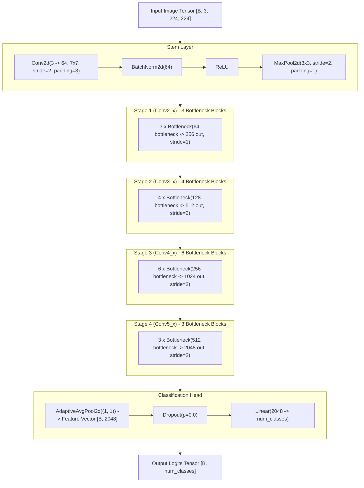

# ResNet-50 Model Architecture & Pipeline Specification

This document provides technical documentation for the custom PyTorch ResNet-50 model architecture, image transformation pipelines, weight initialization rules, parameter statistics, and inference execution engine.

---

## 🏗️ Architecture Specification

The model implementation in [`src/model.py`](file:///d:/resnet%20crop%20detection/src/model.py:L82-L132) is a custom **ResNet-50** deep convolutional neural network built with bottleneck residual blocks.

---

## 🧱 Bottleneck Block Anatomy

The basic building block of the model is the `Bottleneck` residual unit ([`src/model.py`](file:///d:/resnet%20crop%20detection/src/model.py:L13-L80)):
- **Expansion Factor**: `4`
- **1x1 Conv (Reduce)**: Maps input channels to `bottleneck_channels` (no spatial reduction, `bias=False`).
- **3x3 Conv (Process)**: Applies 3x3 convolution with `stride` (handles downsampling when `stride=2`, `padding=1`, `bias=False`).
- **1x1 Conv (Expand)**: Expands channels from `bottleneck_channels` to `out_channels = bottleneck_channels * 4` (`bias=False`).
- **Residual Shortcut Connection**:
  - **Identity Shortcut**: Used when `stride == 1` and `in_channels == out_channels`.
  - **Projection Shortcut**: Used when `stride != 1` or `in_channels != out_channels`. Applies a 1x1 Conv with `stride` and BatchNorm to match spatial and channel dimensions.
- **Zero Initialization**: When `zero_init_residual=True`, the weight gamma of the final BatchNorm (`bn3`) in every bottleneck block is initialized to `0.0`. This forces residual blocks to act initially as identity mappings ([`src/model.py`](file:///d:/resnet%20crop%20detection/src/model.py:L183-L187)).

---

## 📊 Stage Specifications & Tensor Shapes

| Stage | Input Shape | Bottleneck Blocks | Bottleneck Channels | Output Channels | Downsample Stride | Output Feature Map | Source Code Line |
| :--- | :--- | :--- | :--- | :--- | :--- | :--- | :--- |
| **Stem** | `[B, 3, 224, 224]` | — | — | 64 | 2 (Conv) + 2 (Pool) | `[B, 64, 56, 56]` | [`src/model.py:L110-L113`](file:///d:/resnet%20crop%20detection/src/model.py#L110-L113) |
| **Stage 1 (Conv2_x)** | `[B, 64, 56, 56]` | 3 | 64 | 256 | 1 | `[B, 256, 56, 56]` | [`src/model.py:L117`](file:///d:/resnet%20crop%20detection/src/model.py#L117) |
| **Stage 2 (Conv3_x)** | `[B, 256, 56, 56]` | 4 | 128 | 512 | 2 | `[B, 512, 28, 28]` | [`src/model.py:L119`](file:///d:/resnet%20crop%20detection/src/model.py#L119) |
| **Stage 3 (Conv4_x)** | `[B, 512, 28, 28]` | 6 | 256 | 1024 | 2 | `[B, 1024, 14, 14]` | [`src/model.py:L121`](file:///d:/resnet%20crop%20detection/src/model.py#L121) |
| **Stage 4 (Conv5_x)** | `[B, 1024, 14, 14]`| 3 | 512 | 2048 | 2 | `[B, 2048, 7, 7]` | [`src/model.py:L123`](file:///d:/resnet%20crop%20detection/src/model.py#L123) |
| **Pooling** | `[B, 2048, 7, 7]` | — | — | 2048 | Adaptive Global | `[B, 2048, 1, 1]` -> `[B, 2048]` | [`src/model.py:L126`](file:///d:/resnet%20crop%20detection/src/model.py#L126) |
| **FC Head** | `[B, 2048]` | — | — | `num_classes` | Linear | `[B, num_classes]` | [`src/model.py:L128`](file:///d:/resnet%20crop%20detection/src/model.py#L128) |

---

## 📈 Parameter Statistics

Parameter calculation logic is provided in [`src/model.py:L212-L244`](file:///d:/resnet%20crop%20detection/src/model.py#L212-L244):
- **Base ResNet-50 Backbone Parameters**: `~23,500,000`
- **Classifier Head Parameters**: `2048 * num_classes + num_classes`
- **Example Total Parameters (124 classes)**: `23,762,620` (All 100% trainable)
- **Model Storage Size (Float32)**: `~90.64 MB`

---

## 🖼️ Image Transformation Pipelines

Defined in [`src/dataset.py:L78-L123`](file:///d:/resnet%20crop%20detection/src/dataset.py#L78-L123) and [`deployment/preprocessing.py:L12-L22`](file:///d:/resnet%20crop%20detection/deployment/preprocessing.py#L12-L22):

### 1. Training Pipeline (With Data Augmentations)
1. `RandomResizedCrop(224, scale=(0.8, 1.0))`
2. `RandomHorizontalFlip(p=0.5)`
3. `RandomVerticalFlip(p=0.2)`
4. `RandomRotation(degrees=15)`
5. `ColorJitter(brightness=0.2, contrast=0.2, saturation=0.2)`
6. `ToTensor()`
7. `Normalize(mean=[0.485, 0.456, 0.406], std=[0.229, 0.224, 0.225])`

### 2. Validation / Test / Inference Pipeline (Deterministic)
1. `Resize(256)`
2. `CenterCrop(224)`
3. `ToTensor()`
4. `Normalize(mean=[0.485, 0.456, 0.406], std=[0.229, 0.224, 0.225])`

---

## ⚡ Inference Engine & Weights Auto-Download

In deployment, model loading and inference are managed by the `ModelEngine` class ([`deployment/model.py:L12-L146`](file:///d:/resnet%20crop%20detection/deployment/model.py#L12-L146)):
1. **Singleton Pattern**: A global `model_engine = ModelEngine()` instance is initialized.
2. **Startup Initialization**: `load_model()` is executed once during FastAPI lifespan startup.
3. **Weights Auto-Download**: If `checkpoints/best_model.pt` does not exist on disk, `ModelEngine` automatically downloads the checkpoint from Hugging Face Hub (`https://huggingface.co/kanish33/resnet50/resolve/main/best_model.pt`) via `urllib.request` ([`deployment/model.py:L29-L54`](file:///d:/resnet%20crop%20detection/deployment/model.py#L29-L54)).
4. **Dynamic Class Index Mapping**: Class names are loaded from [`results/class_to_idx.json`](file:///d:/resnet%20crop%20detection/results/class_to_idx.json) (or fallback from checkpoint metadata).
5. **Inference Mode**: Forward inference runs inside `@torch.inference_mode()` with `torch.softmax(logits, dim=1)` to extract top-5 confidence predictions.

---

## 📦 Model Artifacts & Outputs

| Artifact Path | Description | Generated By |
| :--- | :--- | :--- |
| [`checkpoints/best_model.pt`](file:///d:/resnet%20crop%20detection/checkpoints/best_model.pt) | Best model weights & training state (model, optimizer, scaler, epoch, class_to_idx). | [`src/train.py`](file:///d:/resnet%20crop%20detection/src/train.py:L631) |
| [`checkpoints/last_model.pt`](file:///d:/resnet%20crop%20detection/checkpoints/last_model.pt) | Latest epoch state for training resumption. | [`src/train.py`](file:///d:/resnet%20crop%20detection/src/train.py:L627) |
| [`results/class_to_idx.json`](file:///d:/resnet%20crop%20detection/results/class_to_idx.json) | Deterministic mapping of class names to integer target indices. | [`src/dataset.py`](file:///d:/resnet%20crop%20detection/src/dataset.py:L61) |
| `results/model_architecture_summary.txt` | Human-readable text summary of ResNet-50 layer shapes and parameters. | [`src/model.py`](file:///d:/resnet%20crop%20detection/src/model.py:L299) |
| `results/model_verification_report.json` | JSON verification report covering dummy, CPU, CUDA forward pass checks. | [`src/model.py`](file:///d:/resnet%20crop%20detection/src/model.py:L378) |
